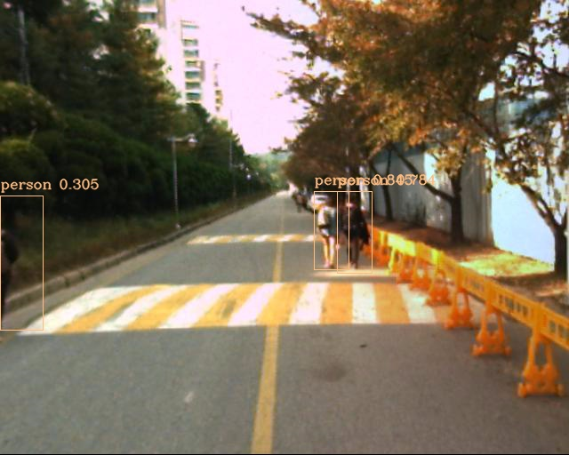
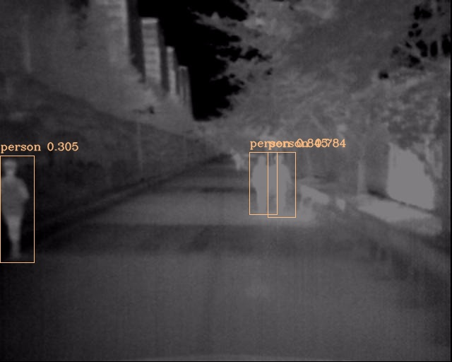
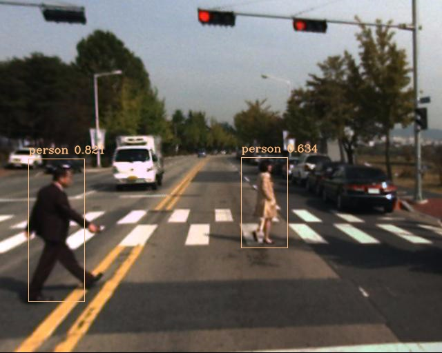
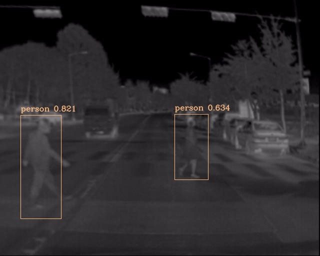

## Multispectral FCOS: Pytorch Implementation Support MS COCO
Implementation of this [paper](https://linkinghub.elsevier.com/retrieve/pii/S0926580522002187)

FCOS code which is similar with this [repo](hhttps://github.com/zhenghao977/FCOS-PyTorch-37.2AP)


### Requirements  
* opencv-python  
* pytorch >= 2.0.1
* torchvision >= 0.15.2 
* matplotlib
* cython
* numpy == 1.17
* Pillow
* tqdm
* pycocotools
* logging

### Modified KAIST Dataset (COCO format)
Train Modified KAIST Dataset on 1 3090 Ti, batch_size = 12, init lr=1e-2.
You can download the dataset in [Google Drive](https://drive.google.com/file/d/160rjtSSoL6kr6ycYmp2_YK3fOk5Ibk2B/view?usp=sharing), no password

### Dataset location
```python
root
   |
   ------coco
           |
           -------annotations
           |            |
           |            ------train_2017.json 
           |            | 
           |            ------val_2017.json 
           |
           --------images
                       |
                       ------train_ir
                       |
                       ------train_rgb
                       |
                       ------val_ir
                       |
                       ----- val_rgb
           
```

Train Modified on 1 3090 Ti, batch_size = 12, init lr=1e-2.
You can download the dataset in [Google Drive](https://drive.google.com/file/d/160rjtSSoL6kr6ycYmp2_YK3fOk5Ibk2B/view?usp=sharing), no password

### Weight
You can download weights in [Google Drive](https://drive.google.com/file/d/1yUH0vp2oAauwO8Vfx9g-u4v43mVK42jx/view?usp=sharing), no password, then run the kaist_eval.py

###  AP Result of this weight
|     AP50     |      **90.6**       |
| :-----------: | :-----------------: |
|     Average MR     |      **24.5**       |
confidence_threshold = 0.25

### Train
```python
train_kaist.py
```

you need to put the dataset and the pretrained weight "ResNet50.pth" in root directory, then run this code.

### Evaluate
```python
kaist_eval.py
```
eval_batch_size = 8, if this is modified, the evaluation results are different, which may be caused by Batch Normalization. 

Meanwhile, parameter "Shuffle" in generator must be "False", otherwise,the results will vary every time 

### Detect
```python
detect_multispectral.py
```
  
  

### there are some details you neet to notice:
as for fcos v1, load model/config_v1.py; as for fcos v2, load model/config_v2.py

do NMS the scores needs to sqrt, which reference to the offical.

the offical use BGR to training and pixel is not normalized to 0~1 , I use RGB and do the normalization.

data augmentation: only random flip

###Acknowledgment
thanks to [@Tencent](https://github.com/Tencent/ObjectDetection-OneStageDet/tree/master), [@Ye-zixiao](https://gitee.com/yezixiao/Double-YOLO-Kaist#https://gitee.com/link?target=https%3A%2F%2Fpan.baidu.com%2Fs%2F1h1e3rZQqIR9MIdiF0W7nXQ) 
and [@CalayZhou](https://github.com/CalayZhou/MBNet), I referenced some codes.


